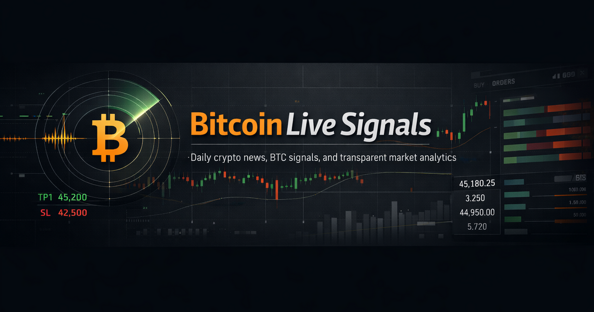

# SmartSignalHub – Bitcoin Live Signals

SmartSignalHub ist ein langfristiges Software- und Datenforschungsprojekt für
Bitcoin-Marktdaten. Die öffentliche Plattform zeigt indikatorbasierte Spot- und
Futures-Signale, Entry-/TP-/SL-Pläne und simulierte Ergebnisse nachvollziehbar
an. Ergänzend macht sie blockierte Einstiege, Markt- und Orderbuchkontext sowie
die Auswertung der Strategielogik sichtbar.

Das Projekt verbindet Datenverarbeitung, regelbasierte Entscheidungen,
Positionssimulation, Diagnosewerkzeuge und automatisch erzeugte Web-Dashboards
in einem durchgängigen System.

**Live:** [sandro-abashishvili.de/Bitcoin-Live-Signals](https://sandro-abashishvili.de/Bitcoin-Live-Signals/)

## Was die Plattform zeigt

- getrennte Übersichten für Spot, Futures und Hedge
- Signale, Einstiegsbedingungen und blockierte Einträge
- simulierte Positionen, TP-/SL-Pläne und abgeschlossene Ergebnisse
- Portfolio-, Strategie- und Trade-Auswertungen
- Orderbuch- und Marktkontext
- verständliche Erklärungen zu sichtbaren Entscheidungen
- tägliche Bitcoin-Nachrichten und weiterführende Ressourcen
- responsive öffentliche Dashboards

## Technischer Ansatz

Das Gesamtsystem wird mit Python, HTML, CSS und JavaScript entwickelt. Python
verarbeitet Markt- und Systemdaten, berechnet Zustände und erzeugt die
öffentlichen Ansichten. Dieses Repository enthält die für GitHub Pages
generierte statische Veröffentlichung.

Die Veröffentlichung wird aus der lokalen Entwicklungsumgebung automatisiert
aktualisiert. Dadurch sind die sichtbaren HTML-Dateien teilweise erzeugte
Artefakte und nicht die vollständige Quellstruktur des Gesamtsystems.

## Status und Grenzen

SmartSignalHub befindet sich in aktiver Entwicklung. Die öffentlich sichtbaren
Bereiche dienen der technischen Demonstration und transparenten Beobachtung
simulierter Strategielogik.

- kein Trading-Bot für fremde Konten
- keine Anlage- oder Finanzberatung
- kein Gewinnversprechen
- Simulationen und laufende Entwicklungsbereiche werden als solche
  gekennzeichnet

## Projektumfang

Das Projekt demonstriert unter anderem:

- modulare Python-Services für Signale, Berechtigungen und Auswertungen
- Verarbeitung externer Markt- und Nachrichtendaten
- getrennte Spot-, Futures- und Hedge-Logik
- automatisch erzeugte Dashboards und Berichte
- Diagnosen, Tests und wiederholbare Publish-Prozesse

## Autor

Sandro Abashishvili

[Portfolio](https://sandro-abashishvili.de/) ·
[GitHub](https://github.com/sandroabashishvili) ·
[LinkedIn](https://www.linkedin.com/in/aleksandre-abashishvili-03417617a/)

